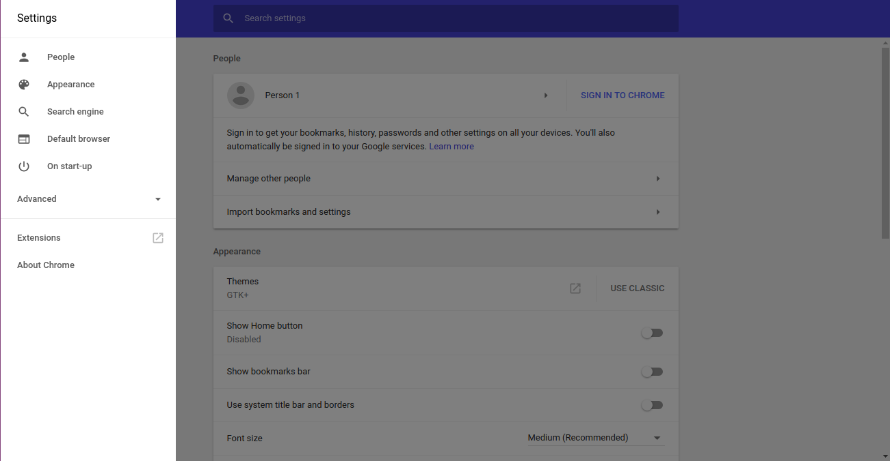
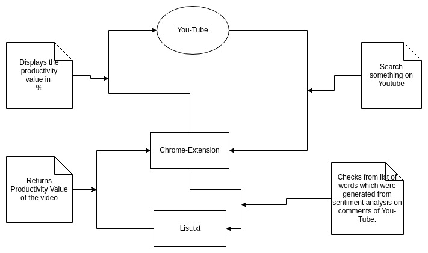
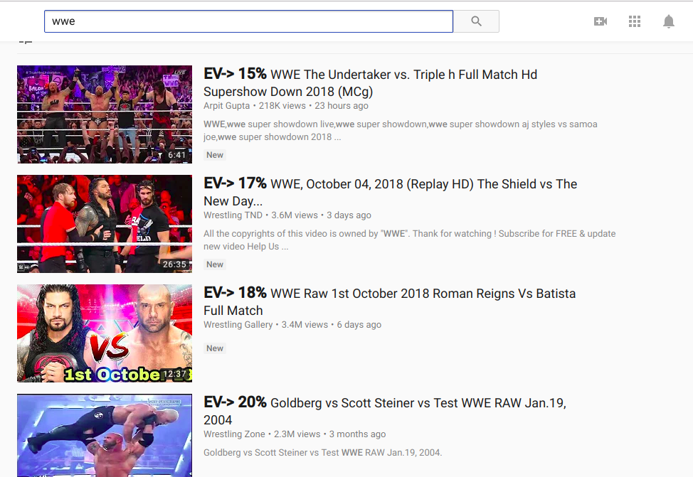
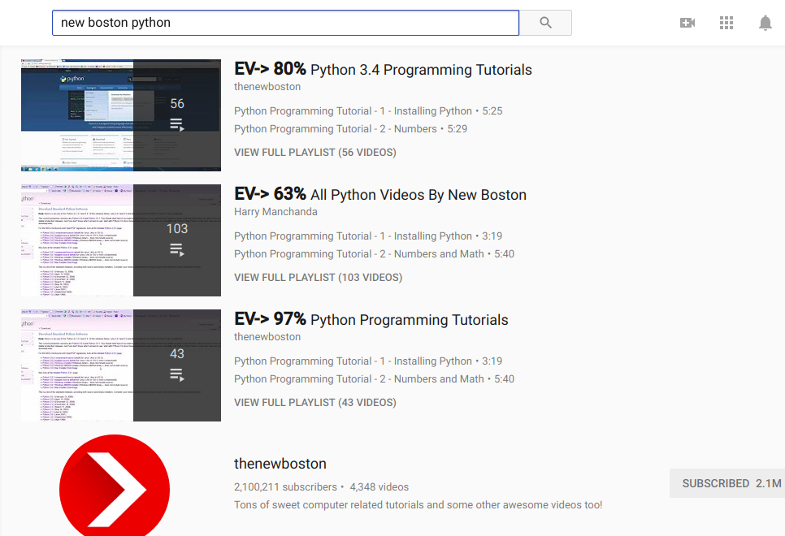

# Youtube-Productivity

## Features
* It prevents wastage of time by tagging videos on the basis of their content (currently).
* Tagged videos can be used for recommendation system on You-Tube.

## Steps to use locally: (currently not available on chrome store)
* Clone the repository `git clone https://github.com/harrypotter0/final_year_project`.
* After cloning the repository go to settings in Chrome browser and select extension.
* Get your Big Huge Labs API key and use it for returning the response.

* Toggle Developer mode to On and select **Load Unpacked**, select Youtube-Productivity
 and click on Open.

## Flow diagram

## Screenshots

* Working

## YouTube video

[Demo](https://youtu.be/kVTM1EDWgec)

## To-Do:
* Extending for the tagging based on the comments. 
* Adding more sub-categories.
* Usuage of Resnet model and YOLO for vid-2-vid frame check and providing the quality score of the video.
