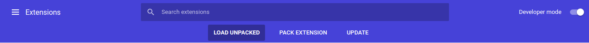

# Youtube-Productivity

* Clone the repository ``.
* After cloning the repository go to settings in Chrome browser and select extension.
* Get your Big Huge Labs API key.

* Toggle Developer mode to On and select **Load Unpacked** and select Knowledge-Value and click on Open.

## Flow diagram

## Screenshots

* Working

## YouTube video

<!-- [Demo](https://youtu.be/kVTM1EDWgec) -->
